# Atividade - Lógica

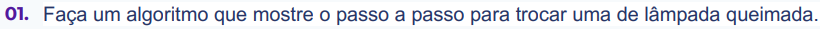

**Resposta:**

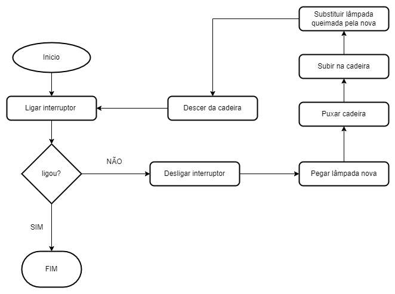

---

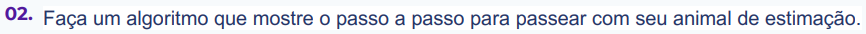

**Resposta:**

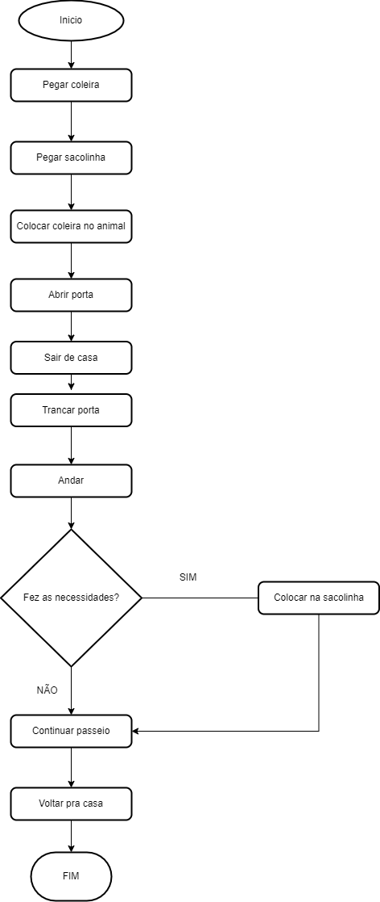

---

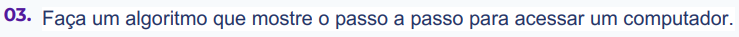

**Resposta:**

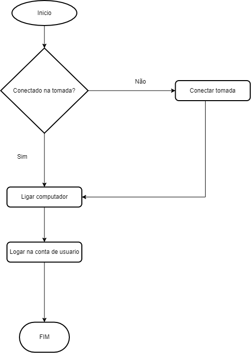

---

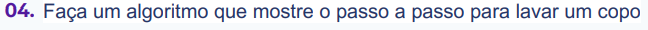

**Resposta:**

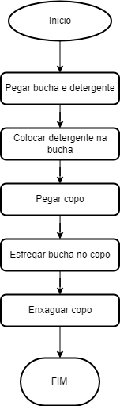

---

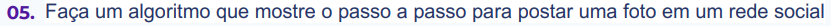

**Resposta:**

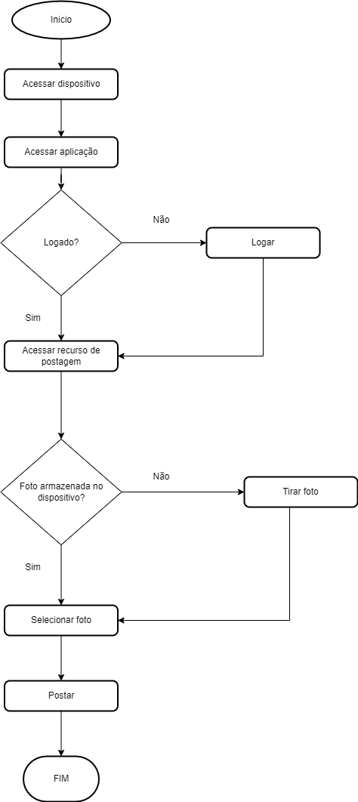

---

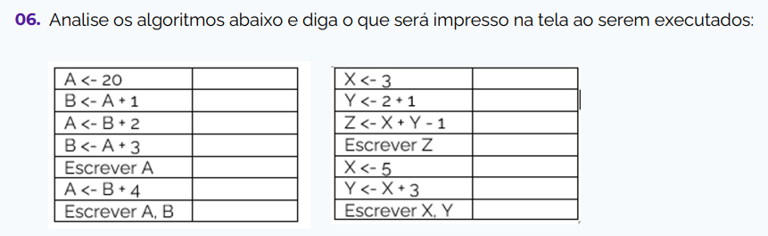

**Resposta:**

a = 20

b = a+1  <= 21

a = b+2  <= 23

b = a+3 <= 26

escreva a

    a == 23

a = b+4

escreva a, b

    a == 30
    b == 26

x = 3
y = 2+1
Z = x + y -1

escreva z

    z == 5

x = 5
y = x+3

escreva x, y

    x == 5
    y == 8

---

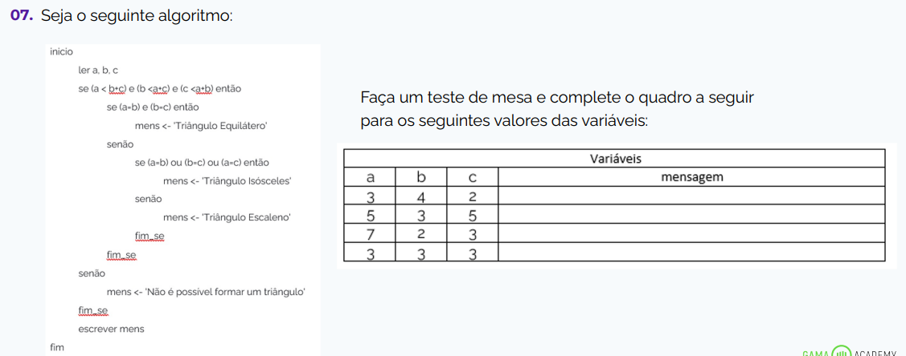
s
**Resposta:**

    mensagem 1 = Triângulo Escaleno

    mensagem 2 = Triângulo Isósceles

    mensagem 3 = Não é possível formar um triangulo

    mensagem 4 = Triângulo Equilátero

---

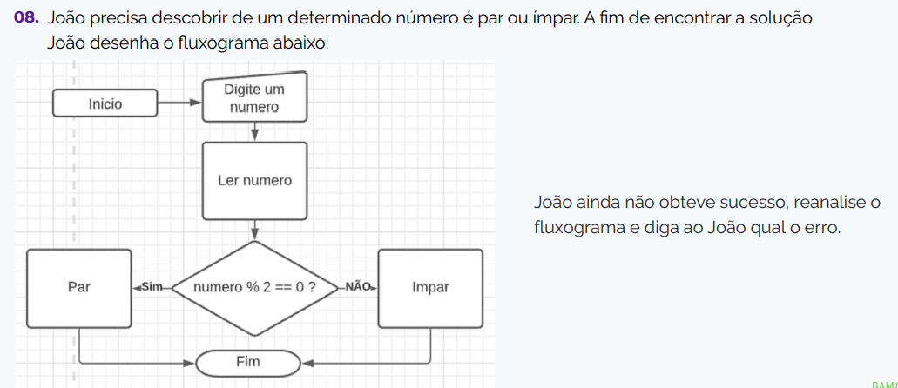

**Resposta:**

    Falta exibir o resultado.

---

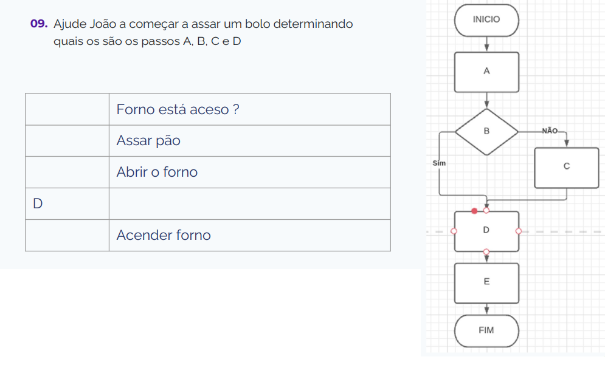

**Resposta:**

    Colocar o bolo/pão no forno.
